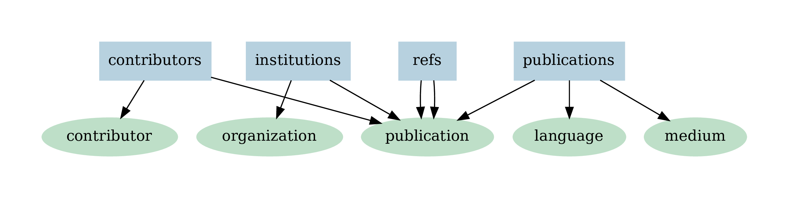
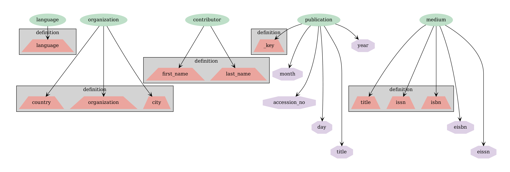
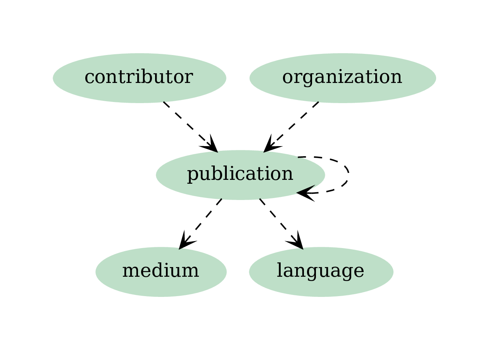
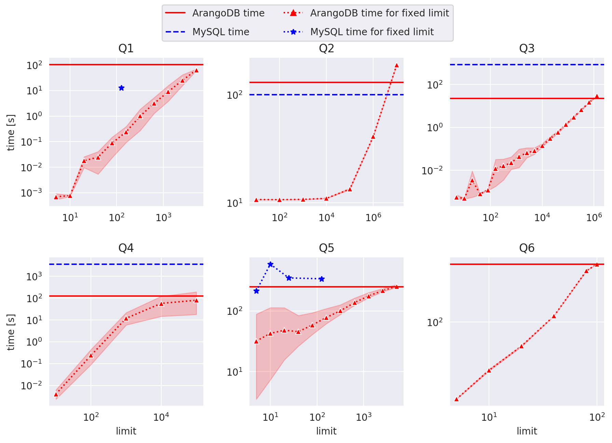

We live in an era of accelerating data generation. The sizes of datasets keep growing and so does their structure. Despite the continuously growing capacity of computers real-world datasets surpass the limits of in-memory processing of even larger commercially available computers, and so data manipulation and analysis has to be aided by the use of databases. Across multiple domains, notably sociology, most interesting phenomena tend to resemble graphs rather than tables.
Graph databases, compared to their more established SQL counterparts, offer multiple advantages, due to a more natural representation of the data. Instead of tables, where each row contains a record with potentially empty fields, in graph databases, entities are vertices and relations between them are represented by edges. A well-known *join* operation is represented as a loop over neighbouring vertices.

In this blogpost we describe how we set up MySQL and ArangoDB [1] databases on a subset of the Web of Science dataset [2] and designed and benchmarked sample queries during our tenure at Knowledge Lab [3].

## Sample Dataset
Web of Science (WoS)  is one of the most complete academic datasets produced by Clarivate Analytics (previously by Thomson Reuters). As of 2017 it covered 12K journals and 160K conference proceedings. It contains publication records including authors, affiliations, references, abstracts etc.
For our test we took a subset of available records published between 1971 and 1980.
To properly highlight the case for graph databases application (and to simplify ingestion scripts) for each record we retrieved and cast the WoS dataset (originally in XML form) as csv-files containing certain relations:
- publications (publication metadata, contains journal information)
- institutions (affiliation data)
- contributors (author data)
- refs (citation data)

As a results we ended up with 5.87M unique publications, 12.3M rows in contributors, 68.7M rows in refs, 163K rows in institutions  (affiliation data coverage seems to be incomplete).

Below are examples of different types of intermediate tables:

**Publications**

| wos_id   | issn   | title     |   pubyear |   pubmonth | language   | source            |
|:---------|:-------|:----------|----------:|-----------:|:-----------|:------------------|
| P1       | J1     | Title1 |     1960  |          1 | English    | CHILD DEVELOPMENT |
| P2       | J1     | Title2 |      1962 |          1 | English    | CHILD DEVELOPMENT |
| P3       | J1     | Title3 |      1963 |          1 | English    | CHILD DEVELOPMENT |

**Contributors**

| wos_id   |   position | first_name   | last_name   |
|:---------|-----------:|:-------------|:------------|
| P1       |          1 | A            | L1          |
| P1       |          2 | A            | L2          |
| P2       |          1 | A            | L3          |

**Institutions**

| wos_id   | organization   | country     | city   |
|:---------|:---------------|:------------|:-------|
| P1       | O1             | Switzerland | Geneva |
| P2       | O1             | Switzerland | Geneva |
| P3       | O1             | Switzerland | Geneva |

**References**

| wos_id   | uid   |
|:---------|:------|
| P8       | P1    |
| P8       | P2    |
| P7       | P4    |

### MySQL setting
CSV files were directly loaded into MySQL database and corresponding indices were created.
MySQL was set up on a desktop with 64Gb of RAM. Ingestion took approximately 35 minutes.

### ArangoDB setting
We used ArangoDB version 3.4, hosted on an Ubuntu 16.04 with 16Gb of ram.
For arangodb each type of csv file (blue) was projected on one or more vertex collections (green). From the point of view of a graph database each encodes not only a node in a vertex collection (potentially non-unique), but also an edge (hopefully unique). The inherent difficulty is to create edges between correct vertices. For that we decide which fields are going to uniquely describe a document from a vertex collection. The ingestion process took approximately 12 hours. While for the SQL test ingestion the tables were simply loaded into a MySQL database, for the graph database we upserted the vertices, i.e. for each vertex *upsert* we had to check if a vertex with the same index fields exists in the collection and retrieve its *id* if it did.

One of the crucial steps is to define the mappings of table columns onto field of vertex collection.
Vertex collections contained the following fields (purple, with indices in boxed fields).

In order to insert edge instances, we first created edge collections as collections between vertex collections. Each document in an edge collection must contai two fields *_to* and *_from*, with corresponding values being the ids of the source and the target vertices.

[comment]: <> ()

Please note the edge connecting *publication* collection to itself, representing citations: both *wos_id* and *uid* have to be mapped to the same *id* of the publication collection.

Our ingestion pipeline used `pyarango` package and arango query language `aql`. 
`pyarango` provides an interfaces to a limited number of functions to manage ArangoDB, so certain steps were executed as `aql` queries.

De-duplication of existing documents (documents are considered identical if defining fields, which were also indexed upon, are the same, grey boxes in the figure above) was part of the ingestion process (see upsert).
The ingestion process took approximately 12 hours, of which citation ingestion took about 8.

### Queries
1. Calculate number of publications per journal for 1978 and return in descending order.
2. Return 1000 most popular words (minus stop words) from all available titles.
3. Find authors who changed their country more than twice.
4. For a given publication *p* compute the ratio *z* of number of second order neighbors to first order neighbors in the directed network of citations.
5. Count the number of times publications from journal *j* published in 1978 cite publications in journal *j’* published in the previous 5 years.
6. Given a subset of publications, compute the cardinality of the power set defined as papers cited by *p*, papers that are cited by papers cited by *p* and so on of order 5. Take the top 100 publications from Q4 with the highest ratio *z*.

Below we plot query times in seconds as a function of the size of the restricting subset, where applicable. Red, solid lines correspond to ArangoDB, blue, dashed lines and star markers - to MySQL. 

For Q1, the limit is on the number of journals.

For Q2 - on the number of publications. 

For Q3 - on the number of contributors. 

For Q4 - on the number of publications.

For Q5 - on both the number of journals which are citing and which are being cited, so the for limit size N, the result is an NxN matrix. We note that Q5 essentially represents Eigenfactor [3] computation.

For Q6 - on the number of source publications.

Arango queries can be found [wos_db_studies/run/queries](https://github.com/alexander-belikov/wos_db_studies/blob/master/run/queries.py)

SQL queries can be found 
[wos_db_benchmark/benchmarking](https://github.com/brendanchambers/wos_db_benchmark/tree/master/benchmarking)

While our MySQL is less complete than that of ArangoDB (the results from Q2-Q4 were close to identical), where applicable the comparison reveals that MySQL shines where expected - in linear queries, such as looping over titles and does not do so well in graph-oriented tasks. Notably the results from ArangoDB for queries 3 and 4 surpass MySQL results by almost two orders of magnitude (!).

### Conclusion

The choice of schemas, the details of index definitions and computer hardware all contribute to the uncertainty of our results.  
Nonetheless, we are able to conclude that: 

* ArangoDB is a robust and well-supported database with excellent documentation (however, the learning curve might be steep compared to MySQL)
* Ingestion time for ArangoDB is greater than that for the MySQL counterpart
* ArangoDB beats MySQL on graph-oriented queries
* *AQL* is expressive with respect to graph-specific queries

### References
1. https://www.arangodb.com/
2. https://en.wikipedia.org/wiki/Web_of_Science
3. https://www.knowledgelab.org/ 
4. http://www.eigenfactor.org/

### Acknowledgements
Prepared with the help of Brendan Chambers.
